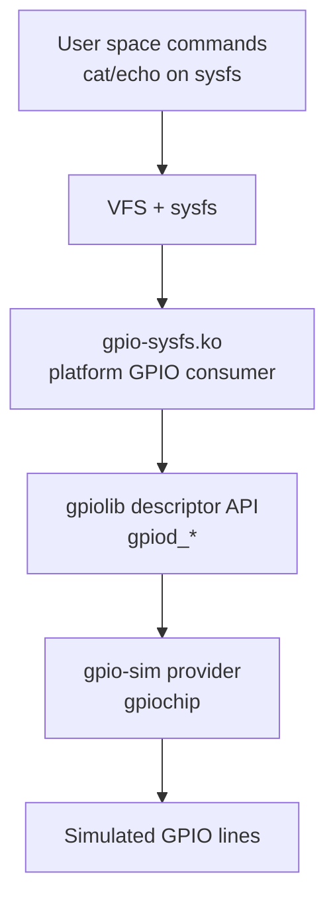
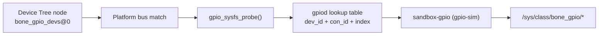
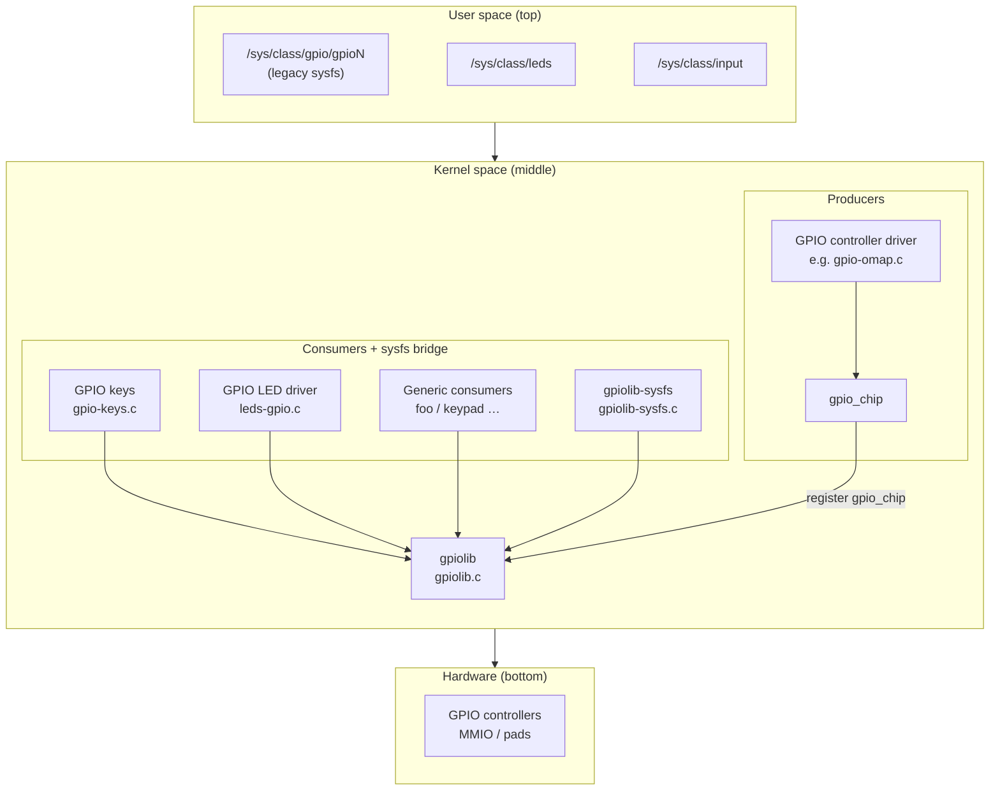

# GPIO Sysfs driver example

This module (`gpio-sysfs.ko`) is a platform-driver GPIO consumer that exposes per-line sysfs files (`direction`, `value`, `label`) under `/sys/class/bone_gpio/`.

## Layer view





## Linux GPIO subsystem (reference diagram)

This section documents the usual Linux GPIO stack: **user space** (sysfs and related classes), **kernel** (consumer drivers, **`gpiolib`**, controller drivers that register **`gpio_chip`**), and **hardware** (GPIO controllers and pads).

### Static diagram


Store **`linux-gpio-subsystem.png`** next to this README under **`gpio-sysfs/img/`** so the path above resolves in checkout and documentation builds.

### Layered flowchart

The flowchart uses the same vertical split. **User space** lists representative sysfs locations. **Kernel space** groups GPIO consumers (including **`gpiolib-sysfs`** for legacy **`/sys/class/gpio`**) above **`gpiolib`**, and shows producers as a **GPIO controller driver** registering a **`gpio_chip`** into **`gpiolib`**. **Hardware** is the GPIO controller block (MMIO or pad logic).



In operation, the **GPIO controller driver** talks to **GPIO controllers** (MMIO registers or pad logic). It exposes lines by registering a **`gpio_chip`** with **`gpiolib`**. **Consumer** drivers and **`gpiolib-sysfs`** obtain and manipulate lines through **`gpiolib`**; the kernel publishes sysfs nodes under **`/sys/class/...`** so user space can observe or control those subsystems.

Representative sysfs links:

- **`/sys/class/gpio/gpioN`** (legacy GPIO sysfs) ↔ **`gpiolib-sysfs`**
- **`/sys/class/leds`** ↔ **`leds-gpio`**
- **`/sys/class/input`** ↔ **`gpio-keys`**

### Scope

The picture is an architectural overview, not an exhaustive kernel map. **`gpiolib`** remains the hub through which **`gpio_chip`** providers and **`gpiod_*`** consumers meet. **`/sys/class/gpio`** with **`gpiolib-sysfs`** is the legacy sysfs GPIO ABI; **`/dev/gpiochipN`** with **`libgpiod`** is the preferred interface for new userspace code. LED and input classes appear when **`leds-gpio`**, **`gpio-keys`**, or similar drivers consume GPIO through **`gpiolib`**. Facilities such as **`gpio-sim`** or **`gpiod`** lookup tables are not drawn; they still follow the same pattern (a **`gpio_chip`** backs lines that consumers resolve at runtime or through descriptors).

### Relation to this module

| Concept in the diagram | Role in this repository |
|------------------------|-------------------------|
| Provider (**`gpio_chip`**) | **`gpio-sim`** registers a virtual chip (`sandbox-gpio`) with simulated lines. |
| Consumer driver | **`gpio-sysfs.ko`** requests lines with **`devm_gpiod_get_index()`**, steered by an in-module **`gpiod`** lookup table to **`sandbox-gpio`**. |
| User space | **`/sys/class/bone_gpio/*`** exposes custom attributes (**`direction`**, **`value`**, **`label`**); this is a teaching sysfs surface, not the kernel’s legacy **`/sys/class/gpio`** ABI. |

## What this example demonstrates

- A **platform driver** matched from Device Tree (`compatible = "org,bone-gpio-sysfs"`).
- A **GPIO consumer** driver obtaining GPIO descriptors via gpiolib.
- A **sysfs user-space interface** to read/write GPIO lines from the guest.
- Integration with **gpio-sim** so you can test without real hardware.

## Quick start

From the container:

```bash
docker exec -it platform-ldd-sandbox bash
cd /workspace/gpio-sysfs
make
cd /workspace/scripts
./launch-qemu.sh run
```

Inside QEMU:

```sh
insmod /modules/gpio-sysfs.ko
ls /sys/class/bone_gpio
cat /sys/class/bone_gpio/gpio-1/label
cat /sys/class/bone_gpio/gpio-1/direction
echo out > /sys/class/bone_gpio/gpio-1/direction
echo 1 > /sys/class/bone_gpio/gpio-1/value
cat /sys/class/bone_gpio/gpio-1/value
```

Expected class devices:

- `gpio-1`
- `gpio-2`
- `gpio-3`
- `user-led0`
- `user-led1`

## Reading and writing attributes

Each device folder under `/sys/class/bone_gpio/` has:

- `label` (read-only): logical name from DT child node.
- `direction` (read/write): accepts `in` or `out`.
- `value` (read/write): accepts `0` or `1`.

Examples:

```sh
# Read current state
cat /sys/class/bone_gpio/gpio-1/label
cat /sys/class/bone_gpio/gpio-1/direction
cat /sys/class/bone_gpio/gpio-1/value

# Change direction then drive output high
echo out > /sys/class/bone_gpio/gpio-1/direction
echo 1 > /sys/class/bone_gpio/gpio-1/value

# Switch to input and read again
echo in > /sys/class/bone_gpio/gpio-1/direction
cat /sys/class/bone_gpio/gpio-1/value
```

Notes:

- `direction` rejects values other than `in`/`out`.
- `value` writes are meaningful when line is configured as output.
- For debugging, check kernel logs: `dmesg | tail -100`.

## Underlying connections (how all pieces fit)

1. `qemu-riscv64-gpio.dtsi` adds `bone_gpio_devs@0` on `platform-bus@4000000` with child nodes (`gpio1`, `gpio2`, ...).
2. The module's `of_match_table` matches `org,bone-gpio-sysfs`, so `probe()` runs for that DT node.
3. In `probe()`, each child node provides a user label (`label = "gpio-1"`, etc.).
4. The driver requests GPIOs via `devm_gpiod_get_index(dev, "bone", i, ...)`.
5. A runtime lookup table in the module maps those indexes to gpio-sim lines.
6. For each resolved line, the module creates a sysfs device in `/sys/class/bone_gpio`.

## What is a GPIO controller?

A **GPIO controller** is the provider side of GPIOs: a kernel driver that registers a `gpio_chip` and exposes GPIO lines to consumers.

- Consumer drivers call `gpiod_*` APIs.
- Provider/controller drivers implement line get/set/direction behavior.

Without a registered controller, consumer requests fail (`ENOENT`/`EPROBE_DEFER` depending on timing).

## Role of `gpio-sim`

`gpio-sim` is a kernel testing provider that creates virtual gpiochips at runtime (via configfs). It acts like a GPIO controller so consumers can run without physical pins.

In this project:

- `setup-gpio-sim` creates a chip labeled `sandbox-gpio`.
- `gpio-sysfs` lookup table maps:
  - index 0 -> line 0 (`gpio-1`)
  - index 1 -> line 1 (`gpio-2`)
  - ...

So the sysfs endpoints in this module control simulated lines.

## What `qemu-riscv64-fake-gpio.dtsi` adds

`qemu-riscv64-fake-gpio.dtsi` adds:

- `sandbox_gpio: gpio@10009000`
- `compatible = "org,sandbox-fake-gpio"`
- `gpio-controller; #gpio-cells = <2>; ngpios = <8>;`

This is useful for DT/phandle experimentation, but by itself it is only a DT node. A matching kernel provider driver must bind and register a `gpio_chip` for it to back consumer requests.

In the current working path, the active provider is `gpio-sim` (runtime), not this fake MMIO node.

## Notes

- Initramfs auto-runs `/usr/bin/setup-gpio-sim chip0 bank0 8 sandbox-gpio` at boot.
- Value access uses `gpiod_get_value_cansleep()` / `gpiod_set_value_cansleep()` to avoid sleepability warnings.